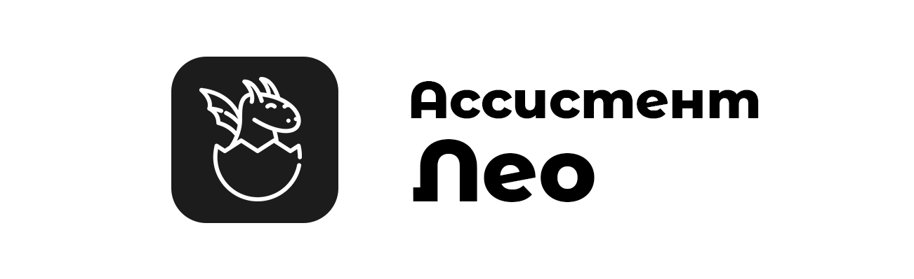

<p align="center">
  <picture>
    <source media="(prefers-color-scheme: dark)" srcset="./banner.png">
    
  </picture>
</p>
Лео — простой голосовой помощник для Windows. Написанный на C#. 
Создается на полном энтузиазме без спонсорской поддержки. Четко 
распознает команды с помощью Vosk API. В начале разработки он не 
планировался как полноценный проект. Изначально он был начат как 
проект для себя, для изучения .NET и С#. Немного позже стало 
понятно, что Лео имеет большой потанцеал, в качестве моего 
первого крупного проекта.
Проект начался внезапно в  начале лета 2023 года. Первоначальное
название ассистена было Poping Cat (Отсылка на мем). Идеей послужил
пост в телеграм канале с кастомной иконкой корзины ввиде знаменитого 
кота. Позже, ближе к концу мая, переименован, так как хотелось внедрить
WakeWord, а с таким сложным именем было сложно к нему обращаться.
Уже за идею иконки и лица проекта был взят дракон. А вот самв идея 
создать своего голосового помощника появиласьпосле того, как я 
посмотрел видео, где писали своего ассистена — Jarvis.
Хочу поблагодарить моих родителей и учителя информатики, за моральную
поддержку и помощь в создании этого проекта.

# Технологии / Technologies
- Text-to-speech
	- <a href="https://github.com/snakers4/silero-models">Silero TTS</a>
- Speech-to-text
	- <a href="https://github.com/alphacep/vosk-api">Vosk Speech Recognition Toolkit</a>
- Weather API
	- <a href="https://openweathermap.org/">OpenWeather</a>
- Wake Word
  - <a href="https://github.com/alphacep/vosk-api">Vosk Speech Recognition Toolkit</a>


# Голосовые Команды / Voice Commands
> English language support for voice commands in development...
- ```Лео``` - Wake Word
### Технические
- ```Открой Телеграм``` -  Запускает Telegram Desktop. Для выполнения требуется установленное приложение телеграмм.
- ```Открой консоль``` - Запускает CMD
- ```Открой ВКонтакте``` - Открывает ВК
- ```Открой почту``` - Открывает Gmail
- ```Открой YouTube``` - Открывает YouTube
- ```Открой ВКонтакте``` - Открывает ВК
- ```Почисти корину``` - Очищает коризну

### Разговорные
- ```Спасибо``` - Благодарность


_В проекте используются иконки с сайта <a href="https://icons8.ru/">Icons8.ru</a>_
