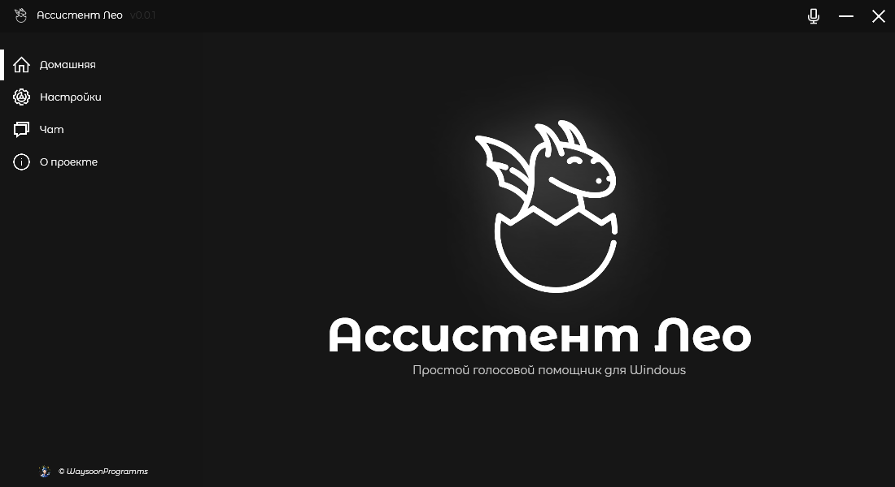

  <picture>
    <source media="(prefers-color-scheme: dark)" srcset="./Assets/Repo/banner.png">
    
  </picture>

  

    
    
    
    
  

<h1> Описание </h1>

Лео — голосовой помощник для Windows. Написанный на C#. 
Четко распознает голос с помощью Vosk API. Был начат как 
проект для изучения программирования на С#. Немного позже стало 
понятно, что он имеет большой потенциал, в качестве моего 
первого крупного проекта.

<h1> История создания </h1>

Проект начался внезапно в начале лета 2023 года. Первоначальное
название ассистента было Popping Cat (Отсылка на мем). Идеей послужил
пост в телеграм канале с кастомной иконкой корзины в виде знаменитого 
кота. Позже, ближе к концу мая, переименован, так как хотелось внедрить
WakeWord, а с таким сложным именем было сложно к нему обращаться.
Уже за идею иконки и лица проекта был взят дракон. А вот сама идея 
создать своего голосового помощника появилась после того, как я 
посмотрел видео, где писали своего ассистента — Jarvis.

<h1> Благодарности </h1>

Хочу поблагодарить моих родителей и учителя информатики, за моральную
поддержку и помощь в создании этого проекта.

<h1> Технологии </h1>

Озвучено голосом Eugene при помощи <a href="https://github.com/snakers4/silero-models">Silero TTS</a>. Точно
распазноет голос <a href="https://github.com/alphacep/vosk-api">Voks API</a>.

<h1> Скриншот приложения </h1>
<picture>
    
</picture>

<h1> Голосовые Команды </h1>

Что-бы активировать ассистента необходимо назвать его имя (<i>Лео</i>). Вы можете как назвать ассистента вместе
с запросом, так и отдельно, разницы нет.

<h2> Что он может: </h2>
<h3> Запускать приложения: </h3>
<ul>
    <li><code>Открой Телеграм</code> - Запускает Telegram Desktop.</li>
    <li><code>Открой консоль</code> - Запускает CMD</li>
</ul>
<h3> Открывать сайты: </h3>
<ul>
    <li><code>Открой ВКонтакте</code> - Открывает ВК</li>
    <li><code>Открой почту</code> - Открывает Gmail</li>
    <li><code>Открой YouTube</code> - Открывает YouTube</li>
</ul>
<h3> Помогать управлять компьютером: </h3>
<ul>
    <li><code>Почисти корину</code> - Очищает корзину</li>
    <li><code>Поставь на паузу</code> - Ставит на паузу музыку</li>
    <li><code>Включи обратно</code> - Снимает с паузы музыку</li>
    <li><code>Следующий/Предыдущий трек</code> - Управляет очередью</li>
    <li><code>Закрой</code> - Закрывает окно в фокусе (BETA)</li>
</ul>

<h1> Коды ошибок </h1>
<ul>
    <li><code>01</code> - Лео не удалось получить доступ к микрофону. Попробуйте разрешить приложению доступ к микрофону: Параметры Windows -&gt; Конфиденциальность -&gt; Разрешения -&gt; Микрофон</li>
    <li><code>02</code> - Не удалось создать запись в реестре</li>
    <li><code>03</code> - Не удалось изменить/удалить запись в реестре</li>
    <li><code>04</code> - Не удалось загрузить последние сообщения из чата</li>
</ul>

<h1> Связаться со мной </h1>
<ul>
  <li> Почта: antrome@yandex.ru </li>
  <li> Telegram: @ant0nio_Way </li>
</ul>

<i>В проекте используются иконки с сайта <a href="https://icons8.ru/">Icons8.ru</a></i>
